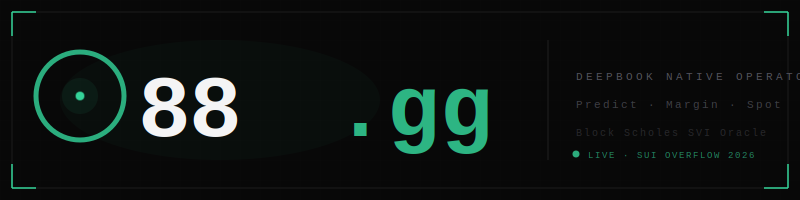

# o88 — DeepBook Native Operator



> **Sui Overflow 2026 · DeepBook Special Track**
> Builder: s111s · Developerror
> Dashboard: [dashboard.o88.gg](https://dashboard.o88.gg)

o88 is a multi-product keeper and arbitrage operator for **DeepBook on Sui**. It captures opportunities across all three DeepBook primitives — **Predict, Margin, and Spot** — using **Block Scholes' on-chain SVI oracle** as its volatility brain.

---

## Why o88 Exists

Block Scholes published their use case for the DeepBook Predict oracle:

> *"Binary contract odds diverge from options-implied probabilities, enabling traders to identify mispricings."*
> — Block Scholes, Use Cases for the SVI Volatility Oracle

o88 delivers that use case. It is the first end-to-end keeper and analytics layer built against DeepBook Predict, Margin, and Spot — with the Block Scholes OracleSVI as the pricing engine.

---

## What's Live

| Bot | Status | Network | Function |
|-----|--------|---------|----------|
| **K-watch** | ✅ Live | Testnet | Monitors settlement queue, countdowns, oracle SVI state, keeper activity |
| **K-redeem** | ✅ Live | Testnet | `predict::redeem_permissionless<DUSDC>` — closes settled positions for anyone |
| **Dashboard** | ✅ Live | Testnet + Mainnet | [dashboard.o88.gg](https://dashboard.o88.gg) — live oracle data, position scanner, keeper analytics |
| **Wallet Redeem** | ✅ Live | Testnet | Browser-signed PTBs — manual backup path for demo and users |
| **Bot M** | Verified | Mainnet | `margin_manager::liquidate` permissionless — entry point confirmed, Rust impl ready |
| **Bot S** | Verified | Mainnet | `pool::borrow_flashloan_{base,quote}` — zero-fee flash loans, cross-DEX arb paths mapped |

---

## Architecture

```
o88/
├── operator/              Rust workspace (Tokio async)
│   └── crates/
│       └── data/
│           └── bin/
│               ├── k_redeem_bot.rs     Bot K — permissionless settlement keeper
│               ├── k_redeem_watch.rs   Bot K — settlement queue monitor
│               ├── inspect_oracle.rs   OracleSVI reader (Block Scholes data)
│               └── positions_by_oracle.rs  Position scanner
├── dashboard/             Next.js 15 + React 19 + Tailwind
│   └── src/
│       ├── app/
│       │   ├── page.tsx               Main dashboard + K-redeem history
│       │   ├── predict/               Predict markets (filterable, categorized)
│       │   └── predict/o/[id]/        Per-oracle cockpit + live SVI data
│       ├── components/
│       │   ├── redeem-button.tsx      Real PTB builder (wallet-signed)
│       │   └── wallet-button.tsx      Custom Sui wallet connect
│       └── lib/
│           └── sui-data.ts            RPC fetchers, position scanner, oracle reader
└── docs/                  Research, manual verification, deployment guides
```

---

## DeepBook Predict — Settlement Keeper (Bot K)

The core pitch: **`predict::redeem_permissionless<Quote>` is an open keeper hook**. Anyone can call it after a market settles to close any user's position and deliver their payout. o88 is a dedicated operator for this hook.

### How it works

1. **Oracle catalog scan** — fetch all oracles from Mysten's predict-server API
2. **Position scan** — find open positions in recently-settled markets (scan 100 DeepBook managers via `suix_getDynamicFields`)
3. **PTB construction** — for each unredeemed position:
   ```
   market_key::new(oracle_id, expiry, strike, is_up)  →  key
   predict::redeem_permissionless<DUSDC>(predict, manager, oracle, key, qty, clock)
   ```
4. **Submit** — signed by the o88 keeper key

### What the dashboard shows

- Live settlement queue with countdown timers
- Per-oracle Block Scholes SVI data: `a, b, σ, ρ, m` + spot/forward prices
- Position breakdown: UP vs DOWN, DUSDC quantities, owner addresses
- Keeper competition: every redemption on-chain with executor address and latency
- Manual override: connect any Sui wallet and sign a redemption PTB directly from the browser

### Block Scholes OracleSVI on-chain struct

```rust
OracleSVI {
    underlying_asset: String,         // "BTC"
    expiry: u64,                      // Unix ms
    active: bool,
    prices: { spot: u64, forward: u64 },   // 1e9-scaled USD
    svi: {
        a: u64, b: u64,               // raw SVI params
        rho: I64, m: I64,             // signed, deepbook i64
        sigma: u64,
    },
    settlement_price: Option<u64>,    // set by Block Scholes cap holder
}
```

Read live via `sui_getObject` — no paid API required.

---

## DeepBook Margin — Liquidator (Bot M)

`margin_manager::liquidate<Base,Quote,Debt>` is fully permissionless — no Cap, no sender check. Rewards: **1% to liquidator + 4% to pool**. Live on mainnet, multiple positions liquidated daily.

Entry point verified against mainnet bytecode:
- Margin package: `0x97d9473771b01f77b0940c589484184b49f6444627ec121314fae6a6d36fb86b`
- MarginRegistry: `0x0e40998b359a9ccbab22a98ed21bd4346abf19158bc7980c8291908086b3a742`

---

## DeepBook Spot — Flash-Loan Arb (Bot S)

`pool::borrow_flashloan_{base,quote}` is permissionless with **zero borrow fee**. The `FlashLoan` hot potato forces return in the same PTB — perfect for atomic cross-DEX arb:

```
DeepBook borrow → swap on Cetus → swap on Bluefin → return to DeepBook
```

26 mainnet pools catalogued. Zero-capital required.

---

## Tech Stack

| Layer | Technology |
|-------|-----------|
| Operator | Rust, Tokio, `sui-sdk`, `sqlx`, `redis` |
| Math | `rust_decimal`, `statrs`, `argmin`, `nalgebra` (SVI calibration) |
| Dashboard | Next.js 15, React 19, Tailwind CSS 4 |
| Wallet | `@mysten/dapp-kit`, `@mysten/sui` |
| Chain | Sui testnet (Predict), Sui mainnet (Margin + Spot) |
| Oracle | Block Scholes OracleSVI read on-chain via `sui_getObject` |
| Data | Postgres 16, Redis |
| Deploy | Vercel (dashboard), Ubuntu 24.04 VPS (operator) |

---

## Running the Bot

```bash
# Clone and build
cd operator
cargo build --release --bin k_redeem_bot

# Configure
cp ../.env.example ../.env
# Set: SUI_TESTNET_RPC, O88_KEEPER_ADDRESS, O88_KEEPER_KEY_HEX,
#      PREDICT_PKG, PREDICT_OBJECT, DUSDC_TYPE, O88_SCAN_INTERVAL_SECS

# Run
cargo run --release --bin k_redeem_bot
```

---

## Immutable Commitments

- No float math for money — `rust_decimal::Decimal` always
- Read-only by default — no live trade without explicit per-action approval
- No secrets in repo — `.env` only, excluded via `.gitignore`
- Log every opportunity, tx, and settlement attempt to Postgres

---

## Milestones & Roadmap

### Sui Overflow 2026 Submission — completed

| # | Milestone | Status |
|---|-----------|--------|
| 0.1 | DeepBook Predict testnet verified — settlement verdict, oracle struct, entry points | ✅ Done |
| 0.2 | DeepBook Margin mainnet verified — liquidate permissionless, reward model, competitors | ✅ Done |
| 0.3 | DeepBook Spot mainnet verified — flash loan mechanics, zero-fee, 26 pools mapped | ✅ Done |
| 1.0 | Dashboard scaffold — Next.js 15, live at dashboard.o88.gg | ✅ Done |
| 1.1 | Block Scholes OracleSVI reader in Rust — parses on-chain SVI params | ✅ Done |
| 1.2 | Settlement queue panel — live oracle data, countdowns, pending/settled status | ✅ Done |
| 1.3 | Bot K-redeem — Rust keeper bot running on VPS, scans every 5s, submits PTBs | ✅ Done |
| 1.4 | Predict market explorer — filterable oracle list, per-cadence categories | ✅ Done |
| 1.5 | Per-oracle cockpit — SVI fair value grid, position scanner, UP/DOWN breakdown | ✅ Done |
| 1.6 | Keeper history panel — tracks every `PositionRedeemed` on-chain, executor addresses, latency | ✅ Done |
| 1.7 | Wallet integration — connect Sui wallet, sign real `redeem_permissionless` PTBs from browser | ✅ Done |

**Current stage: Submission-ready.** Bot K is live on testnet. Dashboard is public at [dashboard.o88.gg](https://dashboard.o88.gg). Margin and Spot entry points verified, executors in progress.

---

### Phase 2 — Post-Hackathon (Bot M + Bot S)

| Milestone | Description |
|-----------|-------------|
| Bot M executor | Deploy `margin_manager::liquidate` Rust executor on mainnet — real liquidation income |
| Bot M health monitor | Subscribe to `MarginManagerCreated` events, track risk ratios for all active managers |
| Bot S flash-loan arb | Atomic PTB: borrow from DeepBook → swap on Cetus/Bluefin → return, capture spread |
| Bot S route optimizer | On-chain price discovery across 26 DeepBook pools + Cetus + Bluefin |

---

### Phase 3 — Bot P (Vol-Aware Predict Operator)

This is the Block Scholes flagship use case — compute SVI-implied binary probabilities and identify when on-chain prices diverge from fair value.

| Milestone | Description |
|-----------|-------------|
| SVI calibration | Fit raw `a, b, ρ, m, σ` to full vol surface; compute `w(k)`, `d₂`, `N(d₂)` |
| Binary fair value | `UP_fair = N(d₂)` — compare against `bid_price` from on-chain catalog |
| Divergence detector | Alert when `|fair − market| > threshold` across all active oracles |
| Mint executor | PTB: `predict::mint<DUSDC>` + DeepBook Spot delta hedge in same transaction |
| Bot P-Liq | `expiry_market::liquidate` — leveraged position liquidator (mainnet only, once live) |
| K-prod | `block_scholes_feed::update` + `propbook::pyth_feed::update` for permissionless settlement push |

---

### Phase 4 — Scale

| Milestone | Description |
|-----------|-------------|
| Mainnet Predict | Deploy Bot K-prod on Day 1 of permissionless settlement launch |
| ETH markets | Extend beyond BTC when Block Scholes adds ETH oracles |
| Multi-asset Bot M | Expand Margin liquidator to all 7 margin pools (currently USDC only) |
| PnL accounting | Postgres + Redis pipeline tracking every opportunity, execution, and realized PnL |
| Dashboard SaaS | Operator analytics tier for other keepers running on the same infrastructure |

---

## Links

- **Dashboard**: [dashboard.o88.gg](https://dashboard.o88.gg)
- **Block Scholes**: [blockscholes.com](https://www.blockscholes.com)
- **DeepBook**: [deepbook.mystenlabs.com](https://deepbook.mystenlabs.com)
- **Manual verification guide**: [`docs/manual-verification.md`](docs/manual-verification.md)
